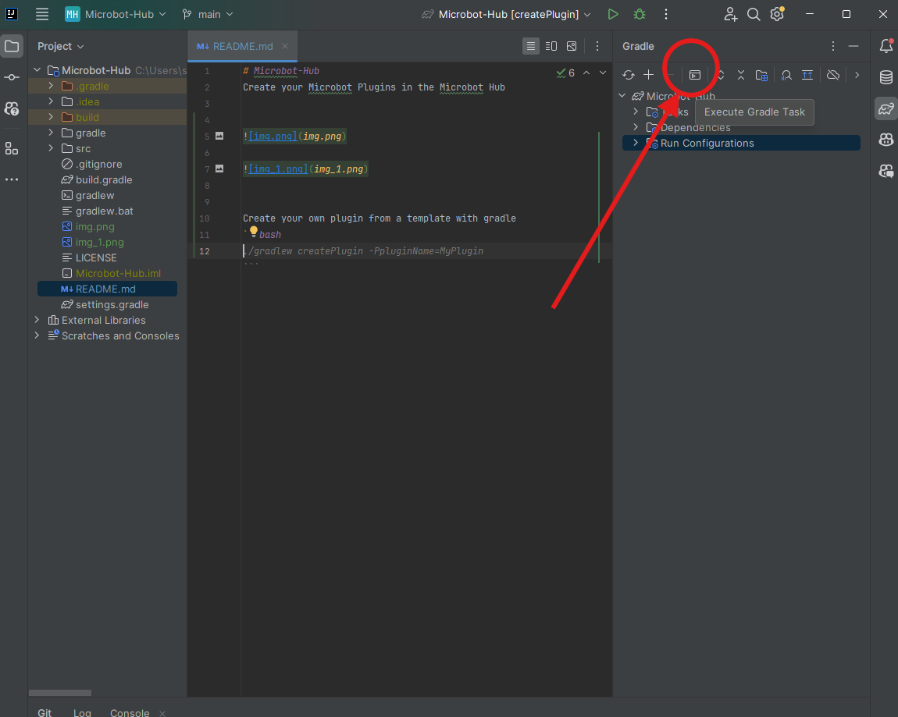

# Microbot-Hub
Create your Microbot Plugins in the Microbot Hub


# 1. Project Setup

## 1.1 Open gradle


## 2.1 Reload all gradle projects


You are now ready to execute gradle commands. Gradle allows us to build our plugins and run microbot.

# 2. How to run Microbot with a plugin



### 2.1 Build & Run a specific plugin(s). Replace `exampletest` with your plugin name.
```bash
gradle build -PpluginList=exampletest
```
### pluginList parameter accepts a comma seperated list of plugin names. For example, if you have two plugins named `exampletest` and `exampletest2`, you can build them both with:
```bash
gradle build -PpluginList=exampletest,exampletest2
```

The build command will 
1. shade jar all the specified plugins and copy them to the .runelite/microbot-plugins folder. 
2. start the microbot client with the specified plugins.


## 3. Build Script Changes

### 3.1 Changes to build.gradle

- **Plugin Discovery and Dynamic Tasks:**  
  The build script now scans the directory `src/main/java/com/microbot/plugins` to detect available plugins automatically.  
  For each detected plugin, a dedicated source set and a `ShadowJar` task are created. This produces an individual shaded jar for every plugin.

- **Dependency Management:**  
  A new configuration is created for each plugin (named with the pattern `[pluginName]ShadowDeps`) to handle additional dependencies listed in an optional `dependencies.txt` file inside each plugin folder.

- **Maven Publishing:**  
  After evaluating the project, each plugin is configured for publication to the Nexus repository. The publication uses plugin metadata from the plugin's `plugin.json` file and attaches the corresponding jar.  
  Credentials are set by using project properties, which are passed from environment variables in CI.

- **Additional Tasks:**  
  A custom task `runMicrobot` is added. It uses the `microbotRuntime` configuration to run the Microbot client with one or several plugins based on the `pluginList` property passed via command line.

### 3.2 Changes to generate-plugins.gradle

- **Automated Plugin JSON Generation:**  
  A new task `generatePluginsJson` has been introduced into the build process. It scans each plugin folder to generate a consolidated `plugins.json`.  
  The generated JSON file includes additional fields:
    - `sha256`: The SHA-256 checksum of the built jar.
    - `url`: A URL constructed to point to the plugin artifact on Nexus.

- **Resource Configuration:**  
  The `processResources` task now depends on `generatePluginsJson` to ensure the JSON file is always up to date before packaging.

- **Plugin Artifact Exclusions:**  
  Raw `plugin.json` files inside plugin directories are excluded from the main resource set to prevent accidental inclusion in the jar.

This update simplifies plugin management by automating jar creation, dependency resolution, and publishing, thus streamlining the process of integrating new plugins into the Microbot Hub.


the file listing all the plugins is generated automatically by the `generate-plugins.gradle` script and deployed to

https://chsami.github.io/Microbot-Hub/plugins.json

