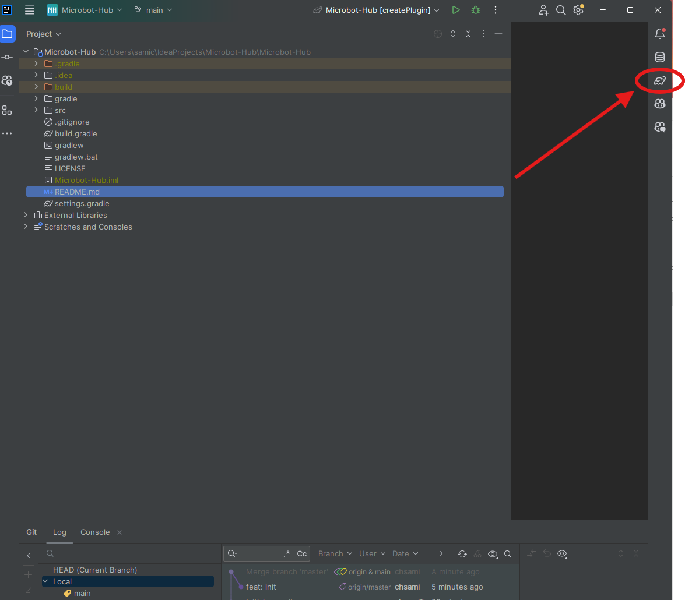
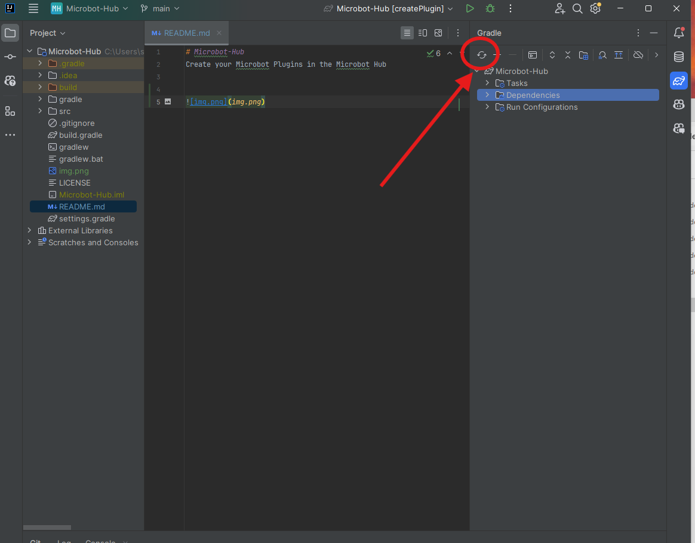
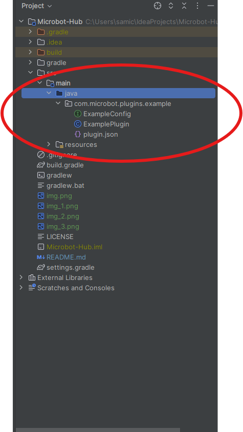
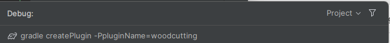
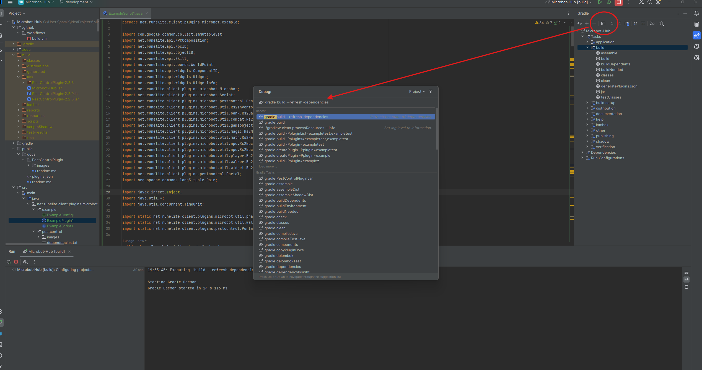

---

# Microbot Hub

Welcome to the Microbot Hub.

The hub is the dedicated place for community created plugins and scripts. It exists to keep the main Microbot client focused on core features while giving contributors a simple way to build, test, and share new ideas. This separation keeps the client lean, fast, and stable. The hub can evolve quickly without risking the reliability of the core application.

## What you will find here

1. Community plugins that extend Microbot
2. A light process to build and test plugins
3. A simple structure that is easy to maintain

## Requirements

1. Java Development Kit that matches the Microbot client version you use
2. Gradle installed or the Gradle wrapper from the repository
3. Git for version control

## Repository layout

Each plugin lives in its own Java package. A typical plugin package can contain the following files and folders:

1. `PestControlPlugin.java` - the primary class for your plugin, extending `Plugin`
2. `PestControlScript.java` - the script class that contains the main logic, extending `Script`
3. Other supporting classes as needed for your plugin

Along side of the plugin's package, comes with a resources folder that contains the following:
1. `docs/README.md` for a short description, setup notes, and known limitations
2. `docs/assets` folder for screenshots or icons that you want to display in the hub
3. `dependencies.txt` for extra Maven coordinates that your plugin needs
4. Any additional resources such as json files, images, or other assets that your plugin needs

Only the files you really use are required. If your plugin has no extra libraries you can omit `dependencies.txt`. If you have no assets/images you can omit the folder.

## Declaring plugin dependencies

If your plugin needs extra libraries, add them to `dependencies.txt`, one line per coordinate in standard Maven format. Example:

```
com.google.guava:guava:33.2.0-jre
org.apache.commons:commons-lang3:3.14.0
```

The build reads this file and adds the coordinates at compile time and packaging time.

## Plugin Descriptor

The plugin descriptor is the most important portion of your plugin class. This annotation tells the Microbot client the general metadata about your plugin, such as its name, description, and version.

```java
@PluginDescriptor(
    name = PluginConstants.DEFAULT_PREFIX + "YourPluginName", // Field to define the plugin name (required)
    description = "Brief description of what your plugin does", // A brief description of the plugin (optional, default is '')
    tags = {"tag1", "tag2", "microbot"}, // Tags to categorize the plugin (optional, default is '')
    author = "Your Name", // Author of the plugin (optional, default is "Unknown Author")
    version = YourPlugin.version, // Version of the plugin (required)
    minClientVersion = "1.9.8", // Minimum client version required to run the plugin (required)
    iconUrl = "https://example.com/icon.png", // URL to plugin icon shown in client (optional)
    cardUrl = "https://example.com/card.png", // URL to plugin card image for website (optional)
    enabledByDefault = PluginConstants.DEFAULT_ENABLED, // Whether the plugin is enabled by default
    isExternal = PluginConstants.IS_EXTERNAL // Whether the plugin is external
)
@Slf4j
public class YourPlugin extends Plugin {
    static final String version = "1.0.0";
    // ... plugin implementation
}
```

### Plugin Descriptor Fields

| Field | Type | Required | Description |
|-------|------|----------|-------------|
| `name` | String | Yes | The display name of your plugin. Use `PluginConstants.DEFAULT_PREFIX` if you do not want to create one. |
| `description` | String | No | Brief description shown in the plugin panel |
| `tags` | String[] | No | Tags for categorizing and searching plugins |
| `author` | String | No | Plugin author name (defaults to "Unknown Author") |
| `version` | String | Yes | Plugin version, typically referenced from a static field |
| `minClientVersion` | String | Yes | Minimum Microbot client version required |
| `iconUrl` | String | No | URL to plugin icon image shown next to the plugin in the Microbot client hub |
| `cardUrl` | String | No | URL to plugin card image used for the plugin card on the website |
| `enabledByDefault` | boolean | No | Whether plugin is enabled by default on first install (use `PluginConstants.DEFAULT_ENABLED`)|
| `isExternal` | boolean | No | Marks plugin as external (use `PluginConstants.IS_EXTERNAL`) |

### Best Practices

- **Naming**: Use or create tags inside of the `PluginConstants` to keep tags consistent across plugins
- **Versioning**: Follow semantic versioning (e.g., "1.0.0", "1.2.3") and store in a static field for easy reference
- **Description**: Keep descriptions concise but informative - they appear in the plugin panel
- **Tags**: Include relevant tags like the game activity, skill, or functionality your plugin provides
- **Version Management**: Always increment the version when making changes, even for small fixes

# Building the project

## 1. Open the Gradle UI



## 2. Refresh the gradle projects



## 3. Run the gradle build command




## 4. Run Microbot in RuneLiteDebug To Test Your Plugin





The build produces plugin jars in the usual Gradle output folders. If the project applies a shading step, the final jars will be placed in the shadow or libs folder depending on the build script.

## Running a plugin in RuneLiteDebug for test purpose

Use this minimal driver to start a focused debug session. Replace `PestControlPlugin` with your plugin class if needed.

```java
package net.runelite.client;

import java.util.Arrays;
import java.util.List;
import java.util.stream.Collectors;
import net.runelite.client.plugins.microbot.pestcontrol.PestControlPlugin;

public class Microbot
{

	private static final Class<?>[] debugPlugins = {
		PestControlPlugin.class
	};

	public static void main(String[] args) throws Exception
	{
		List<Class<?>> _debugPlugins = Arrays.stream(debugPlugins).collect(Collectors.toList());
		RuneLiteDebug.pluginsToDebug.addAll(_debugPlugins);
		RuneLiteDebug.main(args);
	}
}
```

Tips for a smooth session

1. Make sure the Java version you use here matches the version used to build the client (Java 11)
2. Confirm that your plugin class is on the classpath of the debug runner
3. If you see a class version error, rebuild the plugin with the same Java release as the client

## Refresh Plugin Dependencies To Use The Latest Version of The Microbot Client



## Adding plugin docs and images

1. Create `README.md` in the plugin's docs folder under resources with a short description, setup notes, and known limitations
2. Place screenshots in an `assets` folder within the docs folder, e.g., `docs/assets/overview.png`
3. Use relative links in `README.md` to display screenshots in the hub or on the site that reads these files

Example snippet in `README.md`:

```
# Pest Control
Automates the Pest Control minigame. Supports portals and spinners, smart prayer swaps, and activity checks.


```

## Contributing

1. Create a branch with a clear name
2. Keep changes focused on a single plugin or a single feature
3. Run the build and make sure it passes
4. Open a pull request with a short summary and testing steps

## Troubleshooting

**Class was compiled by a newer or older release**
Rebuild the plugin with the same Java release used by the client. Example, if the client uses release 17, set your Gradle Java toolchain to 17 and rebuild.

**Client does not see the plugin**
Confirm the jar is in the plugins folder the client reads. If you use side loading, confirm the folder path in your launcher settings. Make sure the plugin class name matches the expected pattern.

**Missing dependency at runtime**
Place the required coordinate in `dependencies.txt` and rebuild. If the plugin is shaded, ensure the build includes the library inside the final jar.

## Design goals

1. Keep the main client small and focused
2. Allow rapid iteration in the hub without risk to stability
3. Make plugin setup and testing as simple as possible

---
