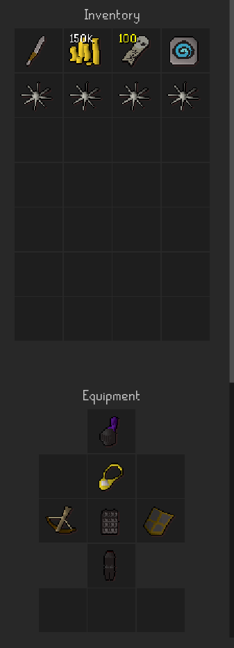

# Wilderness Agility Script

An automated Wilderness Agility Course training script for Microbot.
This plugin is designed to handle agility training at the Wilderness Course, with optional mass-world support and future anti-PK features.  

---

## Features

- Automated agility training at the Wilderness Course  
- Supports both solo and mass-world running  
- Automatic walking and coin deposit if starting outside the course  
- Integration with Webwalker and QOL plugins  
- Basic antiban support (optional, user-configured)  
- Planned future support for **Anti-PK detection and escape logic**  

---

## Configuration

### Inventory (Required)
- **150,000 coins** – Required for paid course entry  
- **Knife** – Needed for fallback walking paths  
- **Ice Plateau teleport** (optional, recommended)  

### Plugin Settings
- **Webwalker**  
  - Enable, and disable “Avoid Wilderness.”  

- **QOL (Quality of Life)**  
  - Enable, and configure:  
    - Disable camera options  
    - Auto-eat: 55–70% threshold  
    - Auto-complete dialogue  
    - Auto Potion Manager (not functional yet)  

- **Antiban Settings**  
  - Configure to preference. Script does not modify these settings.  

- **Break Handler**  
  - Turn OFF (not supported, may cause script stalls).  

- **Teleport Warnings**  
  - Disable teleport warnings if using Ice Plateau teleport.  

---

## Example Inventory & Gear Setup

Below is an example setup for a low level account, any armor tier is fine.  

This image is provided as a **general guideline only**.  

There are no strict requirements other than:  
- A **crossbow** (if running with the AFC Agility clan chat)  
- Some form of **armor** for basic protection  

Everything else is flexible depending on your personal preferences or available gear.  

---

## Start Conditions

### Starting at the Course
- Enable **“Start at course?”** in the config  
- Deposit coins (optional)  
- Remove or open any looting bag  
- Launch the script  

### Starting Anywhere Else
- Disable **“Start at course?”** in the config  
- Have 150k coins, a knife, and optionally an Ice Plateau teleport  
- The script will navigate to the course and handle deposits automatically  

---

## Mass World Setup

- Equip a cheap ranged setup (Leather → Black d’hide with crossbow + bolts)  
- Join one of the following clan chats:  
  - `Agility Fc`  
  - `Free Agility`  
- Start script during active mass runs  
- Monitoring is still strongly recommended as PKers may appear  

---

## Solo Running

- Provides basic functionality only  
- No PK detection or avoidance currently implemented  
- If attacked, you must handle the situation manually  

---

## In Development

- Anti-PK detection and escape logic  
- Improved integration with Break Handler and Potion Manager  

---

## Known Issues

- Occasional failure to leave the Friends Chat during world hop stage  
- Break Handler incompatibility  
- Some features still experimental and may behave unexpectedly  
- Error withdrawing Ice Plateau TP during re-banking.

---

## Contributing

- Contributions, suggestions, and bug reports are much appreciated!    
- This script was originally made just for fun, please feel free to modify it anyway you see fit!

---

## Leaderboards

Submit your best lap, best individual bank haul, and squirrel pulls on the discord to get added!

